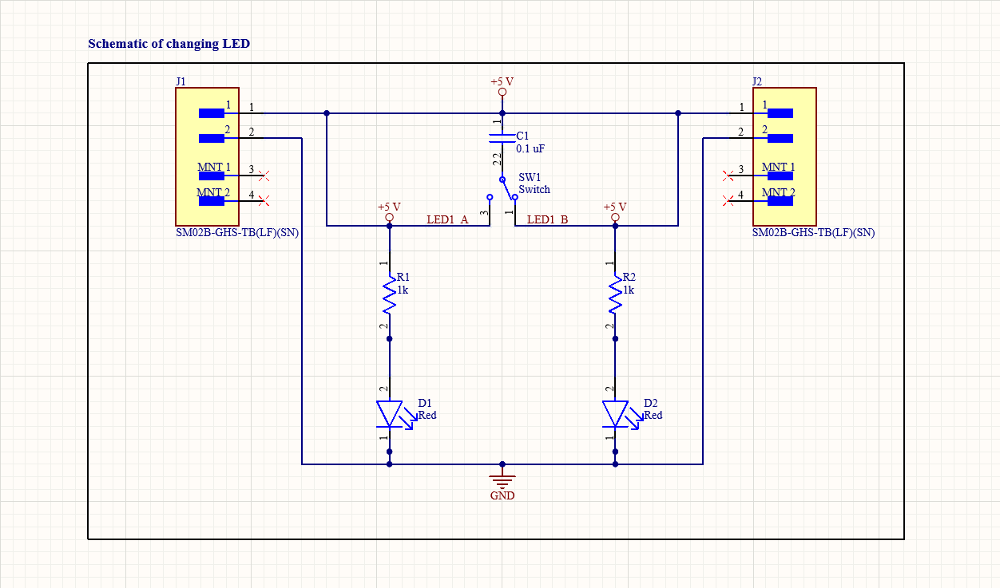
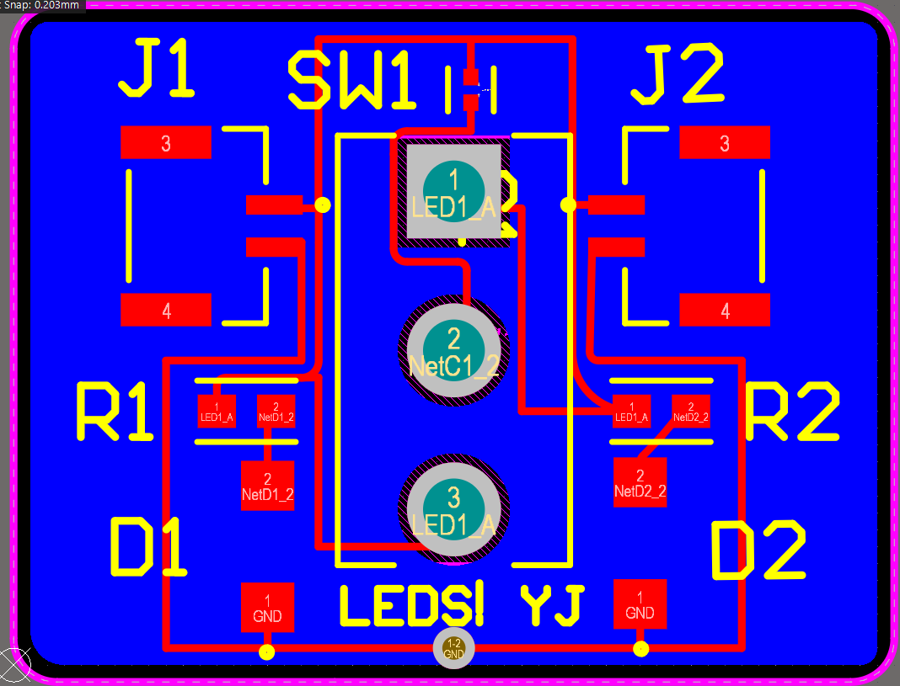
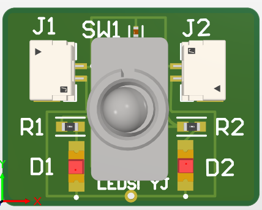

A simple PCB design I created using Altium Designer

## Overview
There are two LEDs, two resistors, a switch, and a voltage source to allow users to choose to illuminate a LED

## Design

### Schematic

### PCB Layout

### 3D View

